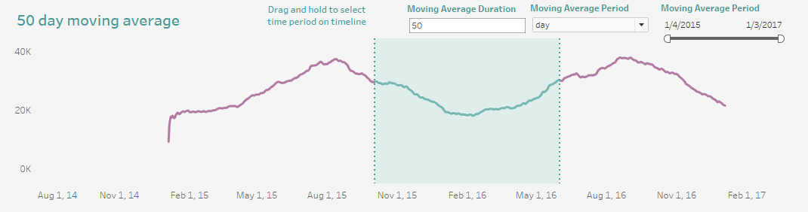
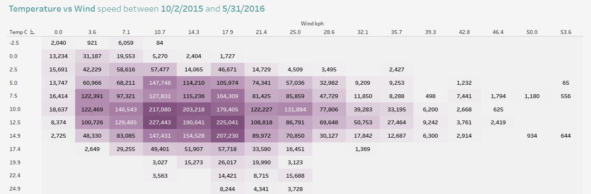
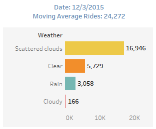
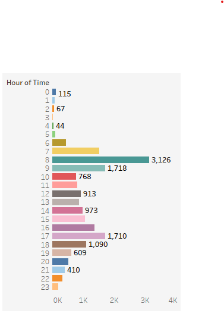

# E2E D&A Series: London Bike Riding - Analytics 🚲

## Project Description
E2E D&amp;A Series: Project #1. Analytics project using Tableau, Python, and historical data for bike sharing in London.

### Dataset Link
The dataset used for this project is available on [Kaggle](https://www.kaggle.com/datasets/hmavrodiev/london-bike-sharing-dataset).

---

### Objectives

1. **Objectives**
   - Data Gathering, Exploring, and Manipulation.
   - Tableau Dashboard Creation.

---

### Results

#### Total Number of Bike Rides

#### Moving Average Period

#### Heatmap - Temperature vs Wind Speed

#### Tooltips - Moving Average Rides
| Rides by Weather  | Rides by Hour |
| ------------- | ------------- |
|   |   |
---

### Outcomes [Tableau & Python]
- Introduction to Tableau and its visualisations: 
   - Usage of Set Actions
   - Usage of User-defined parameters
   - Usage of Timeline filter
- Used Python & Jupyter to explore, clean, and format a Kaggle dataset.
---